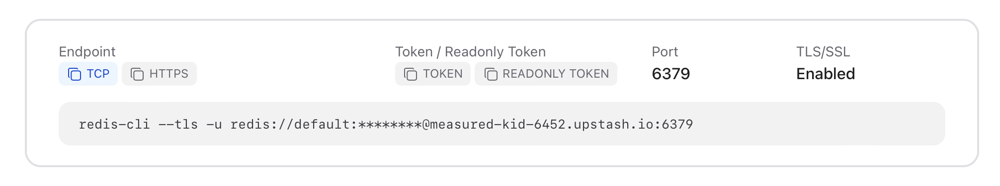
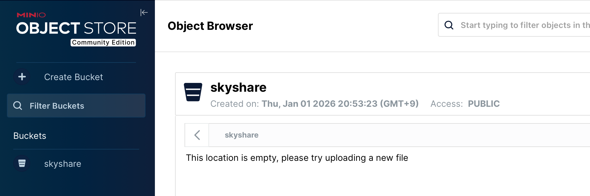

# backend

## 背景

Skyshare v1.5 以前は、複数のバックエンドが点在していることから、どのサービスをどのように立てるがあまりに分かりづらく、めちゃくちゃな状態になっていた。
本事象を解消するため、backend ディレクトリは以下の目的を達成可能なようにバックエンドサービスを置き換える。

1. ポータビリティのあるコード
    - v1.5 以前は firebase を用いており、firebase 以外での稼働を想定していない作りになっていた。これを解消する
2. 簡単かつ本番同等環境での検証を目的とした構成
    - v1.5 以前はローカル用の develop 環境、クラウド用の staging 環境、本番用の production 環境があったが、再現性を考慮し develop 環境を staging 環境に統合する。
    - これはローカルの撤廃を意味するのではなく、クラウド環境とローカル環境が合致できるような状態を目標としている。

## 利用技術

| 技術                   | ライブラリ                                                | 用途                   |
| ---------------------- | --------------------------------------------------------- | ---------------------- |
| API サーバ             | [honojs/hono](https://github.com/honojs/hono)             | API の受付             |
| Redis                  | [redis/ioredis](https://github.com/redis/ioredis)         | OGP データベースを管理 |
| オブジェクトストレージ | [aws-sdk/client-s3](https://github.com/aws/aws-sdk-js-v3) | OGP 画像の保持         |

## 用語

| 名称   | 説明                  |
| ------ | --------------------- |
| PageDB | RedisDB のこと        |
| legacy | v1.6 以前を示す識別子 |

## 環境変数ファイルの作成

ローカルで起動する場合は`.env.dev`、firebase で実行する場合は`.env`が参照される。
`.env`は以下や次章を参考に作成・設定する。

| 環境変数               | 内容                                                                                |
| ---------------------- | ----------------------------------------------------------------------------------- |
| LAUNCH_ENV             | `local` `firebase`に対応                                                            |
| DB_ENDPOINTS           | PageDB を管理する Redis の URL を Array で記載する。                                |
| DB_ENDPOINT_RULE       | PageDB の Redis における制御内容を記載。複雑なため後述                              |
| OBJ_STORAGE_REGION     | OGP を管理するオブジェクトストレージのリージョン                                    |
| OBJ_STORAGE_BUCKET     | OGP を管理するオブジェクトストレージのバケット名                                    |
| OBJ_STORAGE_ENDPOINT   | OGP を管理するオブジェクトストレージの API エンドポイント                           |
| OBJ_STORAGE_CREDENTIAL | オブジェクトストレージの認証情報 `<アクセスキー>:<アクセストークン>` として設定する |
| OBJ_STORAGE_VIEW_URL   | オブジェクトストレージの公開 URL                                                    |

DB_ENDPOINTS の設定例

```json
DB_ENDPOINTS=["redis://localhost:6379","redis://localhost:6479","redis://localhost:6579"]
```

## データベースの設定方法

### Launch on local (redis)

Redis サーバを起動する。

```sh
docker run --name redis-legacy -p 16379:6379 -d --rm -v /tmp/redis:/data redis:8.4.0
docker run --name redis-db1 -p 6379:6379 -d --rm -v /tmp/redis:/data redis:8.4.0
docker run --name redis-db2 -p 6479:6379 -d --rm -v /tmp/redis:/data redis:8.4.0
docker run --name redis-db3 -p 6579:6379 -d --rm -v /tmp/redis:/data redis:8.4.0
docker logs redis-db1
```

```log
Starting Redis Server
1:C 01 Jan 2026 04:34:02.535 # WARNING Memory overcommit must be enabled! Without it, a background save or replication may fail under low memory condition. Being disabled, it can also cause failures without low memory condition, see https://github.com/jemalloc/jemalloc/issues/1328. To fix this issue add 'vm.overcommit_memory = 1' to /etc/sysctl.conf and then reboot or run the command 'sysctl vm.overcommit_memory=1' for this to take effect.
...
1:M 01 Jan 2026 04:34:02.540 * <ReJSON> Exported RedisJSON_V6 API
1:M 01 Jan 2026 04:34:02.540 * <ReJSON> Enabled diskless replication
1:M 01 Jan 2026 04:34:02.540 * <ReJSON> Initialized shared string cache, thread safe: true.
1:M 01 Jan 2026 04:34:02.540 * Module 'ReJSON' loaded from /usr/local/lib/redis/modules//rejson.so
1:M 01 Jan 2026 04:34:02.540 * <search> Acquired RedisJSON_V6 API
1:M 01 Jan 2026 04:34:02.540 * Server initialized
1:M 01 Jan 2026 04:34:02.540 * Ready to accept connections tcp
```

実行する `.env` にパラメータを指定する。以下はデフォルト値である。

```bash
DB_ENDPOINT_WITH_CREDENTIAL="redis://localhost:6379"
```

## Upstash

Redis データベースを作成し、`Endpoint: TCP`から `rediss://default:<Credential>@XXXXXXX.upstash.io:<Port>`となる URL を取得する。


実行する `.env` にパラメータを指定する。

```bash
DB_ENDPOINT_WITH_CREDENTIAL="rediss://default:<Credential>@XXXXXXX.upstash.io:<Port>"
```

### データ配分ルールの設定

複数のテータベースを設定する都合上、あとから DB を追加する等の操作によりページへのデータ登録を偏らせたいケースを考慮し、データ配分ルールが指定できる。

設定ユースケースと例:

-   ユースケース
    -   2026/01/01 に、これまで index0 の DB 一本で運用してきたが、操作が増加したため DB を増設した。
        -   index0 へのデータ挿入は追加 DB の使用状況を考慮し、3 ヶ月後まで一時停止する。
        -   index1,index2 の DB を追加し、それぞれ 1:2 の割合でデータを挿入したい。
        -   3 ヶ月後、データがある程度溜まってきたら、index0 を有効化し、データの追加割合を 1:1:1 にする。
        -   index0 は 12 ヶ月後に無効化したい。
-   上記ユースケースの設定例:

```json
balancing : [
    {
        index: 0,
        weight: 1
        registerBlock: {
            dateBefore: "2026/04/01" // dateBefore以前データを追加しない
            dateAfter: "2027/01/01" // dataAfter以降データを追加しない
        }
    },
    {
        index: 1,
        // weight: 1 // weight: 1は省略可能
    },
    {
        index: 2,
        weight: 2
        migration: {
            dateAfter: "2026/04/01"
            weight: 1 // dateBefore、またはdateAfter以降のweight設定
        }
    },
]
```

設定を`backend/balancing.json`に作成すると、`make serve-XXX`および`make deploy-XXX`の実行時に自動で`.env`中の`DB_ENDPOINT_RULE`の置き換えを行う。
`balancing.json`の読み込み・env 書き換えのみ実行する場合は以下

```bash
make env-gen ENV_DEV=（適応先の.envファイル）
```

| パラメータ名                           | 説明                                                                      | 型     |
| -------------------------------------- | ------------------------------------------------------------------------- | ------ |
| `balancing[].index`                    | PageDB のデータベース番号                                                 | Number |
| `balancing[].weight`                   | 各 PageDB に新規レコードが登録される際の、対象 DB の登録割合              | Number |
| `balancing[].registerBlock`            | PageDB にデータを登録しない条件を設定する                                 | Object |
| `balancing[].registerBlock.dateBefore` | dateBefore 以前に対象の DB にデータを登録しない                           | Date   |
| `balancing[].registerBlock.dateAfter`  | dateAfter 以降に対象の DB にデータを登録しない                            | Date   |
| `balancing[].migration`                | PageDB のマイグレーション操作を目的とした、新規レコード登録割合の変更条件 | Number |
| `balancing[].migration.dateBefore`     | dateBefore 以前の対象 DB のレコード登録割合                               | Date   |
| `balancing[].migration.dateAfter`      | dateAfter 以前の対象 DB のレコード登録割合                                | Date   |
| `balancing[].migration.weight`         | `balancing[].migration`で変更される weight の値                           | Number |

## ストレージの設定方法

注意: オブジェクトストレージはオブジェクトごとに TTL を指定できないため、バケットに対して手動で設定すること

### Launch on local (minio)

バージョン: `RELEASE.2025-10-15T17-29-55Z`にて以下が動作することを確認  
https://qiita.com/torifukukaiou/items/70e55a438bdaea0b09ea

```bash
## ビルドしたminioを起動
docker run -d --rm --name minio-server -p 9000:9000 -p 9001:9001 -e MINIO_ROOT_USER=minioadmin -e MINIO_ROOT_PASSWORD=minioadmin -v /tmp/minio-data:/data myminio:latest
docker logs minio-server
```

```log
INFO: Formatting 1st pool, 1 set(s), 1 drives per set.
INFO: WARNING: Host local has more than 0 drives of set. A host failure will result in data becoming unavailable.
MinIO Object Storage Server
Copyright: 2015-2026 MinIO, Inc.
License: GNU AGPLv3 - https://www.gnu.org/licenses/agpl-3.0.html
Version: DEVELOPMENT.GOGET (go1.24.11 linux/amd64)

API: http://172.17.0.2:9000  http://127.0.0.1:9000
WebUI: http://172.17.0.2:9001 http://127.0.0.1:9001

Docs: https://docs.min.io
WARN: Detected default credentials 'minioadmin:minioadmin', we recommend that you change these values with 'MINIO_ROOT_USER' and 'MINIO_ROOT_PASSWORD' environment variables
```

以下のコマンドでバケットを作成し、スコープを設定する。

```bash
docker exec -it minio-server /bin/sh
wget https://dl.min.io/aistor/mc/release/linux-amd64/mc && chmod +x ./mc && mv ./mc /usr/bin

mc alias set default http://localhost:9000 minioadmin minioadmin
mc mb default/skyshare;
mc anonymous set public default/skyshare;
```

以下のように`Access: PUBLIC`となっていたら成功。


実行する `.env` にパラメータを指定する。以下はデフォルト値である。

```bash
OBJ_STORAGE_REGION="us-east-1"
OBJ_STORAGE_BUCKET="skyshare" ## バケット名
OBJ_STORAGE_ENDPOINT="http://127.0.0.1:9000" ## サーバ起動後のAPI　URL
OBJ_STORAGE_CREDENTIAL="minioadmin:minioadmin" ## サーバ起動時のクレデンシャル情報
```

### R2(Cloudflare)

Cloudflare ダッシュボードで R2 ストレージを作成する。バケットは以下で作成できる。  
`https://dash.cloudflare.com/<UserID>/r2/new`

設定項目は以下

-   バケット名: 任意
-   位置情報: 自動
-   デフォルトのストレージ クラス:Standard

Cloudflare ダッシュボードからユーザー API トークンを取得する。API キーは以下から取得できる。  
`https://dash.cloudflare.com/<UserID>/r2/api-tokens`

設定項目は以下

-   アクセス許可: オブジェクト読み取りと書き込み
-   バケットの指定: 特定のバケットにのみ適用

実行する `.env` にパラメータを指定する。

```bash
OBJ_STORAGE_REGION="auto" ## 位置情報
OBJ_STORAGE_BUCKET="skyshare" ## バケット名
OBJ_STORAGE_ENDPOINT="http://<UserID>.r2.cloudflarestorage.com" ## ユーザAPIトークンから払い出されたURL
OBJ_STORAGE_CREDENTIAL="minioadmin:minioadmin" ## アクセスキー:アクセスシークレット の形式で指定する。
```

## サーバの起動方法

### Launch on local

以下で実行できる。環境変数は`.env.dev`が参照される。

```bash
npm install
make serve-dev
# npm run serve:dev
```

```log
open http://localhost:3000
```

### On cloud(firebase)

firebase 上で動作させる場合、以下の操作を行う。

1. 開発サーバ内で firebase へログインする
2. firebase functions を初期化する。プロジェクトを作成するか、選択する。
3. `npm run serve:firebase` で起動する。
    - `http://127.0.0.1:5001/<プロジェクト名>/us-central1/firebaseAPI` といったエンドポイントで起動する。

```bash
firebase login
firebase init functions
```

以下でエミュレータを実行できる。環境変数は`.env`が参照される。

```bash
npm install
make serve-firebase
# npm run serve:firebase
```

### デバッグ

ローカルで実行するが、トランスパイルを行わない。
環境変数は`.env.dev`が参照される。

```bash
npm install
npm run dev
```

## テスト

### 環境変数ファイルの作成

ローカルで起動する場合は`.env.dev`および`.env.test.dev`、firebase で実行する場合は`.env`および`.env.test`が参照される。
各 env ファイルは`.env.test.template`および以下を参考に作成する

| 環境変数                | 内容                                                          |
| ----------------------- | ------------------------------------------------------------- |
| AT_SERVICE_ID           | テストを実行するためのユーザアカウント名                      |
| AT_SERVICE_PASSWORD     | テストを実行するためのアプリパスワード                        |
| BACKEND_ENDPOINT        | `npm run serve:**`により公開される API サーバのエンドポイント |
| `LEGACY_OBJ_STORAGE_**` | `legacyDbOperation.test.ts`の実行に必要                       |

### テスト実行

ローカル実行する場合は以下

```bash
npm run serve:local
npm run test:local
```

firebase 実行する場合は以下

```bash
npm run serve:firebase
npm run test:firebase
```

## デプロイ

`.env`に本番構築用のパラメータをコピーし、以下のコマンドを実行する。

```bash
make deploy-firebase
```
