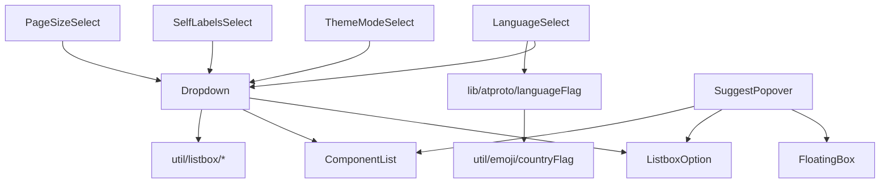

# プルダウン（Dropdown）自前実装 設計書

対応する要件: [`requirements.md`](./requirements.md)

## 1. 全体構成



| 区分               | 配置                                                                         | 責務                                                                                      |
| ------------------ | ---------------------------------------------------------------------------- | ----------------------------------------------------------------------------------------- |
| 新設 common        | `src/components/common/Dropdown/`                                            | トリガー・開閉・キーボード・位置決め・スクロール追従・検索モード（トリガーが入力欄）      |
| 新設 common        | `src/components/common/ListboxOption/`                                       | `role="option"` 1行（ハイライト・選択中表示・mousedown確定）。Dropdown/SuggestPopover共用 |
| 変更 styles        | `src/styles/ui.module.css`                                                   | `data-dropdown` を持つ要素と祖先の `overflow` 解除（§3）                                  |
| 変更 post          | `src/components/post/SuggestPopover/`                                        | 行描画を `ListboxOption` へ移行（§4）                                                     |
| 変更（ラッパー化） | `LanguageSelect` / `ThemeModeSelect` / `SelfLabelsSelect` / `PageSizeSelect` | 選択肢の定義と値の変換のみを持つ薄いラッパーにする（§7）                                  |
| 新設 util          | `src/util/listbox/navigation.ts`                                             | 有効項目間のindex移動、先頭一致検索（ドメイン知識なし）                                   |
| 新設 util          | `src/util/listbox/filter.ts`                                                 | 絞り込み用の文字列正規化と判定                                                            |
| 新設 util          | `src/util/emoji/countryFlag.ts`                                              | ISO 3166-1 alpha-2 → 国旗絵文字                                                           |
| 新設 lib           | `src/lib/atproto/languageFlag.ts`                                            | Bluesky投稿言語コード → 代表国コードの対応表                                              |

`Dropdown` はポータル・`position: fixed` を使わず、パネルをトリガーと同じ外枠（`.select-wrapper`）の中に `position: absolute` で置く。座標は計算せず、スクロール・ソフトウェアキーボードへの追従をブラウザに任せる。コンポーネントディレクトリは `index.tsx` と `index.module.css` のみで構成する。

## 2. Dropdown のインターフェース

```ts
export type DropdownOption = {
  /** 呼び出し側へ返す値。空文字列も有効な値として扱う */
  value: string
  /** アクセシビリティ名・既定の絞り込み対象・キーボード先頭一致検索の対象 */
  label: string
  /** 一覧での表示内容。未指定なら label */
  content?: React.ReactNode
  /** トリガー（現在値）での表示内容（非searchable のみ）。未指定なら content、それも無ければ label */
  triggerContent?: React.ReactNode
  /**
   * 検索トリガー（入力欄）に表示する現在値の文字列（searchable のみ）。
   * 入力欄にはReactNodeを描けないため、国旗絵文字など文字列で表せる装飾はここに含める。未指定なら label
   */
  inputText?: string
  /** 絞り込み対象に追加する文字列（例: 言語コード）。label とは別に評価する */
  searchText?: string
  disabled?: boolean
}

type Props = {
  value: string
  options: DropdownOption[]
  onChange: (value: string) => void
  disabled?: boolean
  /**
   * 検索モードの有無。既定 false。true の場合、トリガー自身が入力欄（`<input>`）になり、
   * パネルは入力欄を持たない（§5.9）
   */
  searchable?: boolean
  /** 検索モードで入力待ちのときのトリガーの placeholder。既定 "入力して検索" */
  searchPlaceholder?: string
  /** 検索モードで入力が空のときにパネルへ出す文言（0件の emptyText とは別）。既定 "入力して検索してください" */
  searchPromptText?: string
  /** 現在値が options に無い場合のトリガー表示。未指定なら value 自体を表示 */
  placeholder?: string
  /** 絞り込み0件・検索入力待ち・options0件のときの文言。既定 "該当する項目がありません" */
  emptyText?: string
  /** true の場合、トリガー幅を選択内容に合わせる。既定は固定幅 */
  autoWidth?: boolean
  className?: string
  id?: string
  ariaLabel?: string
}
```

選択肢の `value` は string のみとし、数値・列挙型への変換はラッパー側で行う。

## 3. 親の overflow の解除（見切れ防止）

`ui.module.css` の `.base-card` は、自身と全子孫に `overflow: hidden` を掛けており、絶対配置のパネルが切れる。そこで、`Dropdown` の外枠に目印 `data-dropdown` を付け、次の規則で「Dropdown を含む要素」だけ解除する。

```css
:local(.base-card):has([data-dropdown]),
:local(.base-card) :has([data-dropdown]),
:local(.base-card) [data-dropdown] {
  overflow: visible;
}
```

- `:has()` は祖先方向にだけ作用するため、Dropdown を含まない要素のクリップは変わらない（他コンポーネントのレイアウトを崩さない）。
- スクロール枠（`Overlay` の `.content` の `overflow: auto` など）は解除しない。枠の中ではパネルは枠内でスクロール可能領域として扱われる。向きと高さを枠の範囲で決めることで枠外へはみ出さない（§5.2）。
- `FloatingBox` は `SuggestPopover` が引き続き使う。`Dropdown` からは参照しない。

## 4. ListboxOption と SuggestPopover の共通化

```ts
type ListboxOptionProps = {
  id: string // aria-activedescendant 参照用
  isActive: boolean
  isSelected?: boolean // Dropdownの選択中表示。SuggestPopoverでは未指定
  disabled?: boolean
  onHover: () => void
  onSelect: () => void
  children: React.ReactNode
}
```

描画:

```tsx
<div
  id={id}
  role="option"
  aria-selected={isSelected ?? isActive}
  aria-disabled={disabled || undefined}
  className={cx(
    styles["option"],
    isActive && styles["option-active"],
    isSelected && styles["option-selected"],
    disabled && styles["option-disabled"],
  )}
  onMouseEnter={disabled ? undefined : onHover}
  onMouseDown={e => {
    // mousedownはblurより先に発火する。preventDefaultでフォーカス(textarea/トリガー)を
    // 維持したまま確定できる。disabledでは何もしない
    e.preventDefault()
    if (!disabled) onSelect()
  }}
>
  {children}
</div>
```

- `aria-selected`: SuggestPopover は従来どおり「アクティブ=aria-selected」。Dropdown は「選択中=aria-selected」とし、アクティブ項目は `aria-activedescendant` で伝える（WAI-ARIA 準拠）。そのため `isSelected` が未指定のときのみ `isActive` を使う。
- CSS は `SuggestPopover/index.module.css` の `.option` / `.option-active` を `ListboxOption/index.module.css` へ移し、`.option-selected`（太字＋左端の強調線）と `.option-disabled`（文字色を `--color-muted`、`cursor: not-allowed`）を追加する。
- `SuggestPopover` は `CandidateOptionRow` の最外 `div` を `ListboxOption` に置き換え、中身（アバター・表示名・handle）はそのまま `children` として渡す。`id` は従来どおり `${listboxId}-option-${index}`。

## 5. Dropdown の内部設計

### 5.1 状態

```ts
type Mode = "list" | "search" // list: 一覧から選ぶ / search: トリガーへ入力して絞り込む
type PanelLayout = {
  vertical: "bottom" | "top"
  horizontal: "right" | "left"
  maxHeight: number // 一覧（スクロール領域）の最大高さ(px)
}
const [open, setOpen] = useState(false)
const [mode, setMode] = useState<Mode>("list") // searchable でのみ "search" になる
const [activeIndex, setActiveIndex] = useState(-1) // visibleOptions 上のindex。-1は無し
const [query, setQuery] = useState("") // 検索モードのトリガー入力値
const [layout, setLayout] = useState<PanelLayout | null>(null) // 開いた直後の配置確定まで null
const triggerRef = useRef<HTMLButtonElement | HTMLInputElement>(null) // 非searchable: button / searchable: input
const panelRef = useRef<HTMLDivElement>(null) // パネル（枠線つきルート）
const listRef = useRef<HTMLDivElement>(null) // スクロール領域
const sizerRef = useRef<HTMLDivElement>(null) // 全選択肢の不可視描画（幅・行高の算出）
const typeaheadRef = useRef({ text: "", timer: 0 })
const listboxId = useId()
```

派生値:

```ts
const selectedOption = options.find(o => o.value === value)
// 検索モードは入力が空の間は候補を出さない（0件と同じ枠で入力待ちの文言を出す）
const visibleOptions =
  mode === "search"
    ? query.trim() === ""
      ? []
      : filterOptions(options, query)
    : options
```

### 5.2 配置の決定（FR-2, FR-3）

座標は持たない。パネルは CSS（`.panel { position:absolute }` + `data-vertical`/`data-horizontal`）でトリガーの直後に置き、スクロール・ソフトウェアキーボードへの追従はブラウザに任せる。JS が決めるのは、開いた直後に一度だけ「向き」と「一覧の最大高さ」である。

```ts
const GAP_PX = 4
const MAX_VISIBLE_ROWS = 5 // 一覧に同時に表示する最大行数
const MIN_LIST_HEIGHT_PX = 96
const EDGE_MARGIN_PX = 8

// 開いた直後（useLayoutEffect。パネルは visibility:hidden で一度描画して実寸を測る）
const rect = trigger.getBoundingClientRect()
const bounds = visibleVerticalBounds(trigger)
const below = bounds.bottom - rect.bottom - GAP_PX - EDGE_MARGIN_PX
const above = rect.top - bounds.top - GAP_PX - EDGE_MARGIN_PX
const chrome = panel.offsetHeight - list.offsetHeight // 枠線（パネルに入力欄は無い）
// 一覧の最大高さ = sizer の先頭 MAX_VISIBLE_ROWS 行の offsetHeight の合計（行高が揃っていなくてもよい）
const maxListPx = sizerRows
  .slice(0, MAX_VISIBLE_ROWS)
  .reduce((sum, row) => sum + row.offsetHeight, 0)
const wanted = chrome + Math.min(list.scrollHeight, maxListPx)
const vertical = below < wanted && above > below ? "top" : "bottom" // 下に収まらず上が広い場合のみ反転
const space = vertical === "top" ? above : below
const maxHeight = Math.max(
  Math.min(MIN_LIST_HEIGHT_PX, maxListPx),
  Math.min(maxListPx, space - chrome),
)
// 横: トリガーの右端に揃える。左へはみ出す場合だけ左端に揃える
const horizontal =
  rect.right - panel.offsetWidth < EDGE_MARGIN_PX &&
  rect.left + panel.offsetWidth <= innerWidth - EDGE_MARGIN_PX
    ? "left"
    : "right"
setLayout({ vertical, horizontal, maxHeight })
```

```ts
// 配置に使える縦方向の範囲 = visualViewport と、祖先のスクロール枠（overflow-y:auto|scroll）の共通部分
const visibleVerticalBounds = trigger => {
  const vv = window.visualViewport
  let top = vv?.offsetTop ?? 0
  let bottom = top + (vv?.height ?? innerHeight)
  for (
    let el = trigger.parentElement;
    el && el !== document.body;
    el = el.parentElement
  ) {
    const o = getComputedStyle(el).overflowY
    if (o === "auto" || o === "scroll") {
      const r = el.getBoundingClientRect()
      top = Math.max(top, r.top)
      bottom = Math.min(bottom, r.bottom)
    }
  }
  return { top, bottom }
}
```

- 向き・最大高さは開くたび（`layout` を `null` に戻して）一度だけ決め、開いている間は再計算しない。絞り込みで一覧が縮んでも、上向きは CSS で下端基準（`bottom: calc(100% + 4px)`）のため、トリガーとの間隔は変わらない。
- パネルの CSS: `.panel { position:absolute; z-index: calc(var(--overlay-z,60) + 5); width:max-content; min-width:100%; max-width:min(24rem, calc(100vw - 16px)); display:grid }`。`min-width:100%` はトリガー（外枠）の幅。`data-vertical="bottom"` は `top: calc(100% + 4px)`、`"top"` は `bottom: calc(100% + 4px)`。`data-horizontal="right"` は `right:0`、`"left"` は `left:0`。
- パネル幅は、`.panel`（`display:grid`）内に全選択肢を不可視・高さ0で描画する `.sizer` を一覧と同じグリッドセルへ重ねて決める（全選択肢で最も広いものに一致し、絞り込みでも変わらない。縦スクロールバー分の余白を行に足す）。幅の JS 計測は行わない（`width:max-content` は置き場所の空きに左右されない）。
- `.list { max-height: <maxHeight>px; overflow-y:auto; overscroll-behavior:contain; position:relative }`。`maxHeight` は `style` で渡す。
- ソフトキーボードの表示・非表示、画面のスクロール、リサイズでは再計算も閉じる処理もしない（iOS ではキーボード表示中の `getBoundingClientRect`・`visualViewport` の値が遷移途中で、JS 計算の座標がトリガーとずれるため。ブラウザの描画に任せるとずれない）。

### 5.3 選択項目・アクティブ項目へのスクロール追従（FR-3）

`scrollIntoView` は祖先（ページ）までスクロールさせてしまうため使わない。一覧コンテナの `scrollTop` を直接調整する。

```ts
// listRef 内で、アクティブ項目が完全に見える位置へ scrollTop を最小限動かす
const ensureVisible = (index: number) => {
  const list = listRef.current
  const el = list?.querySelector<HTMLElement>(
    `#${CSS.escape(`${listboxId}-option-${index}`)}`,
  )
  if (!list || !el) return
  if (el.offsetTop < list.scrollTop) list.scrollTop = el.offsetTop
  else if (el.offsetTop + el.offsetHeight > list.scrollTop + list.clientHeight)
    list.scrollTop = el.offsetTop + el.offsetHeight - list.clientHeight
}
```

- 呼び出しタイミング: (a) 開いた直後の配置確定（`layout` が決まった）後に選択中項目、(b) キーボードで `activeIndex` が変わったとき（`useLayoutEffect([activeIndex])`）。マウスホバーによる `activeIndex` 変更ではスクロールしない（`isKeyboardNavRef` で区別）。
- `offsetTop` が一覧基準になるよう `.list { position: relative }` とする。

### 5.4 開閉とモード（FR-1, FR-5）

```ts
const openPanel = (nextMode: Mode = "list") => {
  if (disabled) return
  setMode(nextMode)
  setQuery("")
  setActiveIndex(nextMode === "list" ? indexOfEnabled(options, value) : -1)
  setOpen(true)
}
// 検索モードへ入る。パネルは閉じず、一覧は入力待ち表示（0件と同じ枠で `searchPromptText`）になる
const enterSearch = () => {
  setMode("search")
  setQuery("")
  setActiveIndex(-1)
  // 入力欄は一覧モードでも編集可能な input のまま inputMode="none"（キーボード非表示）。
  // タップ（ユーザー操作）の中で inputMode を "text" へ DOM に直接書き換えてから再フォーカスし、キーボードを出す。
  // readOnly の切り替えは iOS でキーボードが出ないことがあるため使わない
  triggerRef.current?.focus({ preventScroll: true })
}
const close = (returnFocus: boolean) => {
  setOpen(false)
  setMode("list")
  setQuery("") // 入力値は破棄され、トリガーは直前の選択項目の表示に戻る
  if (returnFocus) triggerRef.current?.focus({ preventScroll: true })
}
const commit = (opt: DropdownOption) => {
  if (opt.disabled) return
  onChange(opt.value)
  close(true)
}
```

- トリガーの `onClick`（searchable）: 閉じていれば `openPanel("list")`、開いていて `mode==="list"` なら `enterSearch()`、開いていて `mode==="search"` なら何もしない（カーソル移動のみ）。非searchable は従来どおり開閉トグル。
- 検索モードで確定できる候補が無い（入力が空・0件）まま Enter、または確定せずに閉じた場合は `onChange` を呼ばず、`value`（直前の選択項目）のまま `close()` する。トリガーの表示は `value` から再描画されるため、直前の選択項目へフォールバックする。
- パネル外クリック: `open` の間 `document` に `mousedown`（capture）を登録し、`contentRef` にも `triggerRef` にも含まれない場合に `close(false)`（入力値は破棄）。
- スクロール・リサイズ・ソフトウェアキーボードの出入りでは閉じない（パネルはブラウザの描画でトリガーに付いて動く。§5.2）。閉じるのは、確定・パネル外の `pointerdown`（`document` に capture で登録）・Esc・Tab・`disabled` 化のみ。
- フォーカスを戻さない閉じ方（パネル外の `pointerdown`・Tab・`disabled` 化）では、トリガーにフォーカスが残っていれば `blur()` する。スクロールバーのクリックなどはブラウザがフォーカスを外さないため、外さないと「閉じたのに入力中（キャレット表示）で現在値が見える」状態になる。
- 検索モードの `blur` 後（iOS のキーボード完了）にパネル外をタップすると、通常どおり `pointerdown` で閉じ、入力は破棄される。
- 検索モード中にトリガーの `blur` が起きた場合（iOS のキーボード完了ボタンはフォーカスだけを外す）は、`setTimeout(0)` 後に「まだ検索モード・フォーカスがトリガーに無い・パネル内を直近500ms以内に押していない」を満たし、かつ入力が空のときだけ一覧モードへ戻す（パネルは開いたまま。検索待ち表示を残さない）。入力済みなら入力と絞り込み結果を残す（クリアしない）。選択肢の操作による blur、`enterSearch` の再フォーカス、`close` の blur では何もしない。
- `disabled` が true になったら開いていれば閉じる（`useEffect`）。
- SSG では `open` が false のためパネルは描画されず、トリガーのみがサーバー描画される（ポータルを使わないため `document` 参照は不要）。`useLayoutEffect` は `open` が false の間は何もしない。

### 5.5 キーボード（FR-4）

イベントの受け口は常にトリガー（非searchable は `button`、searchable は `input`）。パネル内にフォーカス可能な要素は無い。

```
if (e.nativeEvent.isComposing || e.keyCode === 229) return   // IME変換中は何もしない

closed:
  Enter / " "(非searchable のみ) / ArrowDown / ArrowUp → preventDefault, openPanel("list")
  文字キー(searchable) → 入力欄へそのまま入力させ、onChange(入力) で検索モードの開始（下記）
  それ以外 → 何もしない

open（共通）:
  ArrowDown → activeIndex = nextEnabledIndex(visibleOptions, activeIndex, +1)
  ArrowUp   → activeIndex = nextEnabledIndex(visibleOptions, activeIndex, -1)
  Enter     → preventDefault, activeIndex>=0 なら commit(visibleOptions[activeIndex])。候補が無ければ何もせず直前の選択項目のまま（閉じない）
  Escape    → preventDefault, stopPropagation, close(true)           // 親モーダルのEscを発火させない
  Tab       → close(false)（preventDefaultしない=フォーカスは自然に移動。確定はしない）

open かつ mode==="list":
  Home / End → 先頭/末尾の有効項目へ
  " "(非searchable のみ) → preventDefault, commit(active)
  文字キー: 非searchable → typeahead(e.key) / searchable → 検索モードへ入り、その文字を入力として通す

open かつ mode==="search":
  Home / End / " " → 入力欄の編集（カーソル移動・文字入力）に任せる
```

```ts
// 連続入力を600ms間1つの文字列として扱う（非searchable）
const typeahead = (key: string) => {
  clearTimeout(typeaheadRef.current.timer)
  typeaheadRef.current.text += key
  typeaheadRef.current.timer = window.setTimeout(
    () => (typeaheadRef.current.text = ""),
    600,
  )
  const idx = findPrefixIndex(
    visibleOptions,
    typeaheadRef.current.text,
    activeIndex,
  )
  if (idx >= 0) setActiveIndex(idx)
}
```

`findPrefixIndex` は、同一文字の連打（"aaa"）のときは `activeIndex` の次から巡回検索し、それ以外は `activeIndex` 自身を起点に先頭一致を探す（ネイティブ `<select>` と同じ挙動）。

### 5.6 検索（FR-5）

```ts
// util/listbox/filter.ts
export const normalizeForSearch = (s: string) =>
  s.normalize("NFKC").toLowerCase()
export const filterOptions = (options, query) => {
  const q = normalizeForSearch(query.trim())
  if (q === "") return options
  return options.filter(
    o =>
      normalizeForSearch(o.label).includes(q) ||
      (o.searchText !== undefined &&
        normalizeForSearch(o.searchText).includes(q)),
  )
}
```

- `filterOptions` は `DropdownOption` に依存させないため、`{ label: string; searchText?: string }` を満たす型パラメータ `T` のジェネリクスにする。
- 検索モードの入力欄は `value={mode==="search" ? query : inputTextOf(selectedOption)}` の制御入力。`onChange` は `mode==="list"` で文字が入力された場合（キーボード入力）も `enterSearch()` 相当（`setMode("search")`）を行ったうえで `setQuery(入力値)` する。入力が変わるたびに `setActiveIndex(firstEnabledIndex(visibleOptions の新しい値))`。
- 検索モードに入った直後（入力が空）は `visibleOptions` が空で、一覧は `searchPromptText`（既定「入力して検索してください」）を、0件と同じ枠・同じ `role="status"` で表示する（入力待ちの表示）。入力が1文字以上で0件のときは `emptyText`。入力欄は `placeholder`（`searchPlaceholder`）を出し、選択中の表示（`value` 由来の文字列）は一時的に空になる。
- 約180件×NFKC正規化は同期実行で十分高速なため、デバウンス・メモ化は行わない（`useMemo` での `visibleOptions` 算出のみ）。
- IME変換中は入力欄の `onChange` が中間文字列で発火するため、そのまま絞り込みに使う。Enter だけは `isComposing` ガードで確定に使わない。

### 5.7 ARIA（NFR-1）

| 要素                               | 属性                                                                                                                                                                                                                                                                                            |
| ---------------------------------- | ----------------------------------------------------------------------------------------------------------------------------------------------------------------------------------------------------------------------------------------------------------------------------------------------- |
| トリガー（非searchable: `button`） | `role="combobox"` `aria-haspopup="listbox"` `aria-expanded={open}` `aria-controls={listboxId}` `aria-label={ariaLabel}` `id={id}` `aria-activedescendant`（開いている間、`option-<activeIndex>`）                                                                                               |
| トリガー（searchable: `input`）    | `role="combobox"` `aria-autocomplete="list"` `aria-haspopup="listbox"` `aria-expanded={open}` `aria-controls={listboxId}` `aria-label={ariaLabel}` `id={id}` `aria-activedescendant`（開いている間）。`mode==="list"` の間は `inputMode="none"`（テキストボックスのままキーボードだけ出さない） |
| 一覧                               | `role="listbox"` `id={listboxId}`（スクロール領域 `.list` に付与）                                                                                                                                                                                                                              |
| 選択肢                             | `ListboxOption` が `role="option"` `aria-selected`（選択中）                                                                                                                                                                                                                                    |
| 0件・入力待ちメッセージ            | `role="status"`                                                                                                                                                                                                                                                                                 |

### 5.8 描画

```tsx
<span className={cx(ui["select-wrapper"], autoWidth && ui["select-wrapper-auto"])} data-dropdown="">
  {autoWidth && <span className={ui["select-sizer"]} aria-hidden>{triggerSizerContent}</span>}
  {searchable ? (
    <input ref={triggerRef} type="text" className={cx(ui["base-select"], styles["trigger"], className)}
           value={open ? query : (selectedOption?.inputText ?? selectedOption?.label ?? placeholder ?? value)}
           placeholder={searchPlaceholder} inputMode={mode === "list" ? "none" : "text"}
           autoComplete="off" disabled={disabled}
           onClick={…§5.4} onChange={e => …§5.6} onKeyDown={handleKeyDown} …aria />
  ) : (
    <button type="button" ref={triggerRef} className={cx(ui["base-select"], styles["trigger"], className)}
            disabled={disabled} onClick={() => (open ? close(false) : openPanel())}
            onKeyDown={handleKeyDown} …aria>
      {selectedOption ? (selectedOption.triggerContent ?? selectedOption.content ?? selectedOption.label) : (placeholder ?? value)}
    </button>
  )}
  {open && (
    <div ref={panelRef} className={styles["panel"]} data-vertical={layout?.vertical ?? "bottom"}
         data-horizontal={layout?.horizontal ?? "right"} style={{ visibility: layout ? undefined : "hidden" }}>
      <div ref={sizerRef} className={styles["sizer"]} aria-hidden>…全選択肢…</div>
      <div id={listboxId} role="listbox" ref={listRef} className={styles["list"]} style={{ maxHeight: layout?.maxHeight }}>
        {visibleOptions.length === 0
          ? <p role="status" className={styles["empty"]}>{mode === "search" && query.trim() === "" ? searchPromptText : emptyText}</p>
          : <ComponentList items={visibleOptions} itemComponent={DropdownOptionRow}
              getItemProps={(item, index) => ({ index, listboxId, isActive: index === activeIndex,
                isSelected: item.value === value, onHover: …, onSelect: () => commit(item) })}
              getItemKey={item => item.value} />}
      </div>
    </div>
  )}
</span>
```

- `.trigger` は `ui["base-select"]` の `display:block; width:100%` を前提に、`<select>` と同じ外観（文字色・矢印の余白・省略表示）になるよう `text-align:left; cursor:pointer` を追加するのみとし、矢印は `ui["select-wrapper"]::after` の既存実装をそのまま使う。`input` のときも同じクラスで同じ外観にする（`color` は `ui["base-select"]` の色を継承させ、placeholder は `--color-muted`）。
- 可変幅（`autoWidth`）は `ui["select-wrapper-auto"]` の「幅は sizer に任せる」方式を踏襲する。sizer には選択中の表示内容（searchable は `inputText ?? label`）を描画して幅を一致させる。`ui["select-wrapper-auto"] > select, > button` に加え `> input` も対象にする。
- フォーカスリング: `.trigger:focus-visible` に `border-color` で既存のフォーカス表現と同系統の枠色を付ける。
- `DropdownOptionRow` は `ListboxOption` に `content ?? label` を渡す行コンポーネント。`id` は `${listboxId}-option-${index}`。

### 5.9 検索モードの遷移まとめ

| 状態     | 操作                                        | 結果                                                                                                                                                  |
| -------- | ------------------------------------------- | ----------------------------------------------------------------------------------------------------------------------------------------------------- |
| 閉       | クリック/タップ、Enter/↓/↑                  | 一覧モードで開く（選択中項目へスクロール）。キーボードは出ない                                                                                        |
| 開・一覧 | トリガーを再度クリック/タップ（searchable） | 検索モードへ。パネルは閉じず、一覧は入力待ち表示（0件と同じ枠で「入力して検索してください」）。トリガーは空・placeholder 表示、ソフトキーボードが出る |
| 開・一覧 | 文字キー入力（searchable）                  | 検索モードへ入り、入力された文字で絞り込む                                                                                                            |
| 開・検索 | 入力                                        | 入力文字列を含む候補のみ一覧に表示。先頭の有効項目がアクティブ                                                                                        |
| 開・検索 | 候補をクリック/タップ、Enter                | 確定して閉じ、トリガーは新しい選択項目の表示になる                                                                                                    |
| 開・検索 | 候補が無い状態で Enter                      | 何もしない（開いたまま）                                                                                                                              |
| 開・検索 | Esc / パネル外クリック / Tab                | 確定せず閉じる。トリガーは直前の選択項目の表示に戻る                                                                                                  |

## 6. 国旗（FR-8）

### 6.1 util/emoji/countryFlag.ts

```ts
/**
 * ISO 3166-1 alpha-2（例: "JP"）を国旗絵文字へ変換する。
 * 地域指示記号 U+1F1E6〜U+1F1FF の2文字連結。`/^[A-Za-z]{2}$/` 以外は undefined。
 */
export const countryCodeToFlagEmoji = (code: string): string | undefined => {
  if (!/^[A-Za-z]{2}$/.test(code)) return undefined
  const base = 0x1f1e6 - "A".charCodeAt(0)
  return String.fromCodePoint(
    ...[...code.toUpperCase()].map(c => base + c.charCodeAt(0)),
  )
}
```

### 6.2 lib/atproto/languageFlag.ts

```ts
/** Bluesky投稿言語コード → 代表国（ISO 3166-1 alpha-2）。国を持たない言語はキー自体を持たない */
const LANGUAGE_REPRESENTATIVE_COUNTRY: Record<string, string> = { ja: "JP", ko: "KR", ... }
export const languageCodeToFlagEmoji = (languageCode: string): string | undefined => {
  const country = LANGUAGE_REPRESENTATIVE_COUNTRY[languageCode]
  return country === undefined ? undefined : countryCodeToFlagEmoji(country)
}
```

対応表の決定ルール（全言語の対応表はこのルールで `languageFlag.ts` に定義する。個別の割り当ては実装時の裁量に委ねるが、ルール自体は固定する）:

1. その言語を公用語とする国が1つだけ、または明確な本拠国がある場合はその国（`ja→JP` `ko→KR` `fr→FR` `de→DE` `it→IT` `ru→RU` `tr→TR`）。
2. 複数国にまたがる言語は、次の通り代表国を固定する: `en→US` `es→ES` `pt→BR` `zh→CN` `ar→SA` `hi→IN` `bn→BD` `ms→MY` `sw→TZ`。
3. 次のいずれかに当たる言語は国旗なしとする（キーを持たない）: 人工言語（`eo` `ia` `ie` `io` `vo`）、古典・典礼言語（`la` `cu` `pi` `sa` `ae`）、特定の国と対応づけられない少数言語。
4. 判断に迷う言語は国旗なしとする（誤った国旗を表示するより、表示しない方を優先する）。

### 6.3 LanguageSelect での利用

```ts
const options: DropdownOption[] = UNIQUE_BLUESKY_POST_LANGUAGES.map(l => {
  const flag = languageCodeToFlagEmoji(l.code)
  return {
    value: l.code,
    label: l.label,
    searchText: l.code,            // "ko" でも "한국어" でも絞り込める
    content: (
      <span className={styles["language-option"]}>
        <span className={styles["flag"]} aria-hidden="true">{flag ?? ""}</span>
        {l.label}
      </span>
    ),
    inputText: flag ? `${flag} ${l.label}` : l.label,   // 検索トリガー（input）の現在値表示
  }
})
```

- 一覧用 `content` は国旗スロット（`.flag`: `display:inline-block; width:1.5em; text-align:center`）を常に持ち、国旗なしでもラベルの位置を揃える。
- トリガー（`input`）は `inputText`（国旗がある言語のみ `<flag> <label>`、無ければ `label`）を表示する。ReactNode の `triggerContent` は searchable では使わない。

## 7. 既存4種のラッパー化（FR-9）

各ラッパーは、選択肢配列の定義と、値の型変換だけを行う。

| ラッパー           | `searchable` | 値の変換                                                                                                                                                |
| ------------------ | ------------ | ------------------------------------------------------------------------------------------------------------------------------------------------------- |
| `LanguageSelect`   | `true`       | なし（文字列）。`autoWidth` はそのまま `Dropdown` へ渡す                                                                                                |
| `ThemeModeSelect`  | `false`      | `onChange(v)` で `THEME_MODE_OPTIONS.some(o => o.value === v)` を確認して `ThemeMode` へ                                                                |
| `SelfLabelsSelect` | `false`      | `value ?? ""` を渡す。`onChange("")` は `onChange(undefined)`、それ以外は `CreateEntryBodySelfLabels` へ。`value=""` の選択肢「ラベルなし」を先頭に持つ |
| `PageSizeSelect`   | `false`      | `String(option)` ⇔ `Number(v)`。`Number.isNaN` の場合は無視                                                                                             |

- ラッパーの公開 Props から `name` を除く（`<select>` のフォーム送信用属性で、`Dropdown` はフォーム要素ではないため）。呼び出し側（`ThreadSegmentForm` ほか）の `name` 指定を削除する。`id`/`ariaLabel`/`className`/`disabled`/`autoWidth` は維持する。
- `LanguageSelect` / `SelfLabelsSelect` の `autoWidth` 用 sizer と `index.module.css` の `.select` / `.select-auto` は、`Dropdown` が `autoWidth` を処理するため、固定幅クラスのみを `className` として `Dropdown` へ渡す形に整理する。
- `SELF_LABEL_OPTIONS`（`DraftListPanel` が参照）と `BLUESKY_POST_LANGUAGES` の公開は維持する。

## 8. テスト設計

| 対象                           | 種別       | 内容                                                                                                                  |
| ------------------------------ | ---------- | --------------------------------------------------------------------------------------------------------------------- |
| `util/emoji/countryFlag`       | vitest     | `JP`→🇯🇵、小文字、2文字以外・数字・空文字は undefined                                                                  |
| `lib/atproto/languageFlag`     | vitest     | `ja`→🇯🇵、`en`→🇺🇸、`eo`→undefined。`BLUESKY_POST_LANGUAGES` の全コードについて、対応表の値が `/^[A-Z]{2}$/` であること |
| `util/listbox/navigation`      | vitest     | 無効項目の飛ばし、端で止まる、全無効で -1、Home/End、先頭一致（連打巡回・大文字小文字無視）                           |
| `util/listbox/filter`          | vitest     | 全角半角・大文字小文字の同一視、`searchText` 一致、空クエリで全件                                                     |
| Dropdown / 4ラッパー / Suggest | Playwright | tasks.md の各Phaseに記載                                                                                              |
