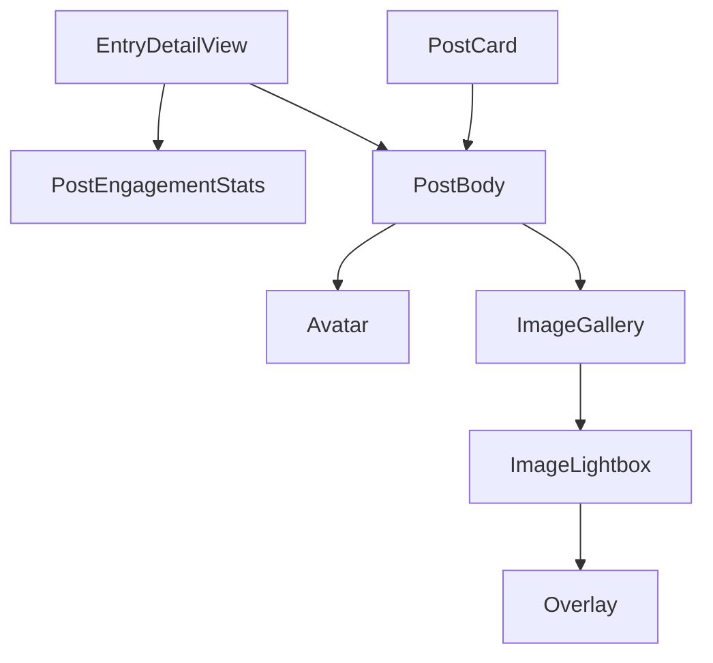

# 投稿カード表示・画像拡大 設計書

要件は [requirements.md](./requirements.md) を参照する。

## 1. 方針

- 投稿カードの表示部（作者・日時・本文・画像）を、操作ロジックを持たない表示専用の `PostBody` として `PostCard` から切り出し、Timeline（`PostCard`）と Entry詳細ページの両方から使う（FR-6）。
- 画像のサムネイル表示と拡大表示を `image` カテゴリの `ImageGallery`（サムネイル）・`ImageLightbox`（拡大）として新設する。`PostBody` は `ImageGallery` を内包する。
- Entry詳細ページは、単発とスレッドの区別なく「ヘッダーカード＋投稿カード配列」の1つの描画経路に統合する。`EntryDetailView`・`EntryThreadView` は廃止し、1つの `EntryDetailView` に置き換える。
- サムネイル・拡大表示で使う画像URLは、既存の `SourceImage.url`（`feed_fullsize`）をそのまま使う。サムネイル用のリサイズURLへの変換は行わない。

## 2. データ

### 2.1 `SourceImage` の拡張（`src/lib/entry/entry.ts`）

縦横比の事前把握（NFR-1 のカード高さ変動の防止、FR-3 の縦横比維持）のため、`SourceImage` に任意の縦横比を持たせる。

```ts
export type SourceImage = {
  url: string
  alt: string
  cid: string
  /** 画像レコードの `aspectRatio`。未設定・不正値の場合は `undefined` */
  aspectRatio?: { width: number; height: number }
}
```

`toSourceImages` は、各 item の `aspectRatio` が `width`・`height` ともに正の有限数のときだけ上記へ詰める（それ以外は設定しない）。既存の `{ url, alt, cid }` を期待する呼び出し側は影響を受けない（追加フィールドは任意）。

### 2.2 Entry詳細ページの表示用データ（`src/pages/entries/[slug].astro` → `EntryDetailView`）

```ts
export type EntryPostView = {
  webUrl: string
  author: { handle: string; displayName?: string; avatar?: string }
  createdAt: string // ISO文字列。表示整形は PostBody が行う
  text: string
  images: SourceImage[]
  engagement: {
    likeCount: number
    repostCount: number
    replyCount: number
    quoteCount: number
  }
}
```

`engagement` は各投稿自身の `PostView`（`likeCount`・`repostCount`・`replyCount`・`quoteCount`、数値でなければ 0）から作る（FR-8）。

`[slug].astro` は従来の取得結果から `posts: EntryPostView[]` を組み立てる。

| 状況                                              | `posts`                                                                                      |
| ------------------------------------------------- | -------------------------------------------------------------------------------------------- |
| スレッド抽出結果が2件以上                         | `chain.map(...)`。各 `post.author`・`record.createdAt`・`extractSourceImages` から構成する。 |
| 抽出結果が1件、または抽出失敗（フォールバック）   | `postView` 1件分から構成した長さ1の配列                                                      |
| 元投稿が削除済み（`sourcePostAvailable = false`） | 空配列                                                                                       |

`visualUrl` は `manifest.visual` の CDN URL（無ければ空で非表示）。ヘッダーカード内に拡大表示なしの画像として表示する。

`manifestCaption` は従来、Entry自体のキャプションが無い場合に `sourceText.slice(0, 280)` で上書きしていた。ヘッダーカードに本文が二重表示されないよう、次のように分離する。

- `manifestCaption`: `entry.manifest.caption` のみ（ヘッダーカードに表示する）。
- `metaDescription`: `manifestCaption || sourceText.slice(0, 280)`（`Baselayout` の `pageCaption` にだけ渡す）。

## 3. コンポーネント



### 3.1 `ImageGallery`（`src/components/image/ImageGallery/index.tsx` + `index.module.css`）

サムネイル表示と拡大表示の起動を担う。拡大中の画像インデックスをこのコンポーネントが保持する。

```ts
type Props = {
  images: SourceImage[] // 最大 MAX_POST_IMAGES(10) 枚。超過分は描画しない
  interactive?: boolean // 既定 true。false の場合は拡大表示を持たない静的表示にする
}
```

レイアウト判定は純関数 `resolveGalleryLayout`（`src/lib/image/galleryLayout.ts`）に分離する。

```ts
export type GalleryLayout =
  | { kind: "grid"; count: 1 | 2 | 3 | 4; singleRatio?: number } // singleRatio は count===1 のときのみ
  | { kind: "strip" }

export const GRID_MAX_COUNT = 4
export const SINGLE_RATIO_MIN = 0.75 // 縦長側の下限（width/height）
export const SINGLE_RATIO_MAX = 2 // 横長側の上限

export const resolveGalleryLayout = (
  images: SourceImage[],
): GalleryLayout | null => {
  if (images.length === 0) return null
  if (images.length > GRID_MAX_COUNT) return { kind: "strip" }
  if (images.length === 1) {
    const r = images[0].aspectRatio
    const raw = r ? r.width / r.height : 1.5 // 縦横比不明は 3:2 とみなす
    const singleRatio = Math.min(
      SINGLE_RATIO_MAX,
      Math.max(SINGLE_RATIO_MIN, raw),
    )
    return { kind: "grid", count: 1, singleRatio }
  }
  return { kind: "grid", count: images.length as 2 | 3 | 4 }
}
```

描画（`layout.kind` による分岐）:

- **grid**: コンテナを `border-radius: var(--radius-md); overflow: hidden; display: grid; gap: 2px`。
  - count=1: `aspect-ratio: ${singleRatio}`（インラインstyle）。
  - count=2: `aspect-ratio: 2 / 1; grid-template-columns: 1fr 1fr`。
  - count=3: `aspect-ratio: 2 / 1; grid-template-columns: 1fr 1fr; grid-template-rows: 1fr 1fr`。1枚目に `grid-row: 1 / span 2`。
  - count=4: `aspect-ratio: 2 / 1; grid-template-columns: 1fr 1fr; grid-template-rows: 1fr 1fr`。
  - 各セルの `` は `width:100%; height:100%; object-fit: cover`。
- **strip**: コンテナを `display:flex; gap: var(--space-1); height: var(--gallery-strip-height); overflow-x: auto; overscroll-behavior-x: contain`（`--gallery-strip-height: 10rem`、`index.module.css` 内で定義）。各セルは `flex: 0 0 auto; height: 100%` とし、`aspectRatio` があれば `aspect-ratio: w / h`（インラインstyle）で幅を決める。`` は `width:100%; height:100%; object-fit: cover` とする（セルの比率が画像の比率に一致するためクロップは発生しない）。`aspectRatio` が無い画像のセルは `aspect-ratio` を指定せず、`` を `height:100%; width:auto; min-width: 5rem` で置き、画像本来の比率で表示する。

`interactive === false` の場合、サムネイルは `<button>` ではなく `<div>` とし、クリックハンドラ・`ImageLightbox`・フォーカス復帰を持たない（レイアウトは同一）。以下は `interactive` が `true` の場合の記述である。

各サムネイルは `<button type="button" aria-label="画像{i+1}/{N}を拡大">` の中に `` を置く。クリックで `openIndex = i` とする。`openIndex !== null` のとき `ImageLightbox` を描画する。サムネイルの `ref` を保持しておき、閉じた際に該当ボタンへ `focus()` を戻す（NFR-2）。

### 3.2 `ImageLightbox`（`src/components/image/ImageLightbox/index.tsx` + `index.module.css`）

```ts
type Props = {
  images: SourceImage[]
  index: number
  onIndexChange: (next: number) => void
  onClose: () => void
}
```

- `Overlay`（`open` 固定 `true`）を土台とする。`backdropClassName` に暗い全画面背景（`background: rgb(0 0 0 / 90%)`）、`contentClassName` に全画面の配置用クラスを渡す。Esc・背景クリックでの閉鎖、背面スクロールのロック、入れ子時のEsc制御は `Overlay` が既に提供しているものをそのまま使う（FR-4）。
- 表示: 現在の `images[index]` を `` で `max-width:100vw; max-height:calc(100dvh - 7rem); object-fit: contain` で表示する。下部に alt（空なら非表示）と、`images.length > 1` のとき「`{index+1}/{images.length}`」を表示する。
- 操作: 右上に閉じるボタン（`aria-label="閉じる"`）。`images.length > 1` のときだけ、左右の前後ボタン（`aria-label="前の画像"`/`"次の画像"`、端では `disabled`）を表示し、ArrowLeft/ArrowRight の `keydown`（`document`に登録、アンマウントで解除）で `onIndexChange(index ∓ 1)` を呼ぶ（端を超えない）。
- スライド表示: 現在・前・次の画像（`index-1..index+1`）を、画像領域内に `position:absolute; inset:0` のスライドとして描画する。各スライドは `transform: translateX(calc((i - index) * 100% + dragX))` で横に並べ、`transition: transform 0.3s ease-out` を持つ。キーはインデックス `i` とし、`index` が変わると同じ要素が隣の位置へ滑る（前後ボタン・矢印キーも同じアニメーション）。現在以外のスライドは `aria-hidden`・空 alt とする。`prefers-reduced-motion: reduce` では遷移を無効にする。
- スワイプ: 画像領域で `pointerdown` の x を記録し（ボタン上は除外）、`pointermove` で `dx = x - startX` が 8px 以上になったらドラッグ開始（`setPointerCapture`）として、`dragX = dx` でスライドを指に追従させる（この間 `transition: none`）。先頭・末尾で隣が無い方向へ引く場合は追従量を 0.3 倍にする。`pointerup` で `Math.abs(dx) >= 50` かつ隣があれば、`dx < 0` なら次、`dx > 0` なら前へ切り替え、満たなければ `dragX` を解除して元の位置へ戻す（`pointercancel` は常に戻す）。ドラッグ開始後の直後の `click` は背景クリックとして扱わない。画像領域に `touch-action: pan-y` を指定する。
- フォーカス: マウント時に閉じるボタンへ `focus()`。Tab は拡大表示内の操作要素（閉じる・前・次）だけを巡回させる（`keydown` Tab で先頭/末尾を折り返す）。
- 先読み: 隣のスライドを描画することで `index ± 1` の画像を先読みする。

### 3.3 `PostBody`（`src/components/post/PostBody/index.tsx` + `index.module.css`）

```ts
type Props = {
  author: { handle: string; displayName?: string; avatar?: string }
  createdAt: string // ISO文字列
  text: string
  images: SourceImage[]
  /** false の場合、画像を拡大表示できない静的な表示にする（既定 true） */
  imagesInteractive?: boolean
  postUrl?: string // 指定時は日時表示を Bluesky ページへのリンク（target=_blank）にする
  engagement?: {
    likeCount: number
    repostCount: number
    replyCount: number
    quoteCount: number
  } // 指定時のみ画像の下に PostEngagementStats を表示する
}
```

`PostCard` 内の author-block・本文・サムネイルの現行マークアップ（`Avatar` md、表示名、`@handle`、`toLocaleString("ja-JP", { dateStyle: "medium", timeStyle: "short" })` の日時、`white-space: pre-wrap` の本文）をそのまま移し、画像は `images.length > 0` のときだけ `<ImageGallery images={images} interactive={imagesInteractive ?? true} />` を本文の下に描画し、`engagement` が指定されている場合は画像の下に `<PostEngagementStats {...engagement} />` を描画する。`text` が空なら本文の `<p>` を出さない。ルート要素は `<div>`（カードの枠・背景は呼び出し側が持つ）とし、`PostCard` の author-block・text 用CSSは `PostBody` の `index.module.css` へ移動する。

### 3.4 `PostCard` の変更（`src/components/post/PostCard/index.tsx`）

- `top-row`・`content-column`・`thumbnail` 系のマークアップとCSS（`.top-row`, `.content-column`, `.thumbnail`, `.thumbnail-slice`, `.thumbnail-more`, `.author-block`, `.author-meta`, `.author-name-row`, `.handle`, `.created-at`, `.text`）を削除し、`PostBody` に置き換える（props は下記）。footer 以下（ツールバー・各ダイアログ・Loading）は変更しない。
- Timeline に表示する画像は、その投稿が Skyshare Entry を持つか（`activeEntry`、`display.kind` が `entry`・`deleting`）で分ける（FR-5）。
  ```ts
  // Entry を持つ投稿（スレッドのルート投稿・単独投稿）は visual を1枚、静的に表示する
  const entryVisualImages: SourceImage[] | undefined = activeEntry?.visualUrl
    ? [{ url: activeEntry.visualUrl, alt: "", cid: activeEntry.visualUrl }]
    : undefined
  const galleryImages = entryVisualImages ?? item.images
  const imagesInteractive = entryVisualImages === undefined
  ```
  Entry を持つ投稿では元画像（`item.images`）は表示せず、`visual` のみを `imagesInteractive={false}` で表示する（拡大表示なし）。`activeEntry` があっても `visualUrl` が無い場合は、元画像を `imagesInteractive` のまま表示する。元投稿が削除済みで `item.images` が空の orphaned entry も、同じ規則で `visual` を表示する。Entry を持たない投稿（スレッドの返信投稿を含む）は元画像を拡大可能なサムネイルとして表示する。
  `visual` は OGP 仕様（`TARGET_WIDTH`×`TARGET_HEIGHT` = 1200×630、`@/lib/image/postImageProcessing`）で生成されるため、`aspectRatio: { width: TARGET_WIDTH, height: TARGET_HEIGHT }` を設定し、クロップせず全体を表示する。
- `<PostBody ... images={galleryImages} imagesInteractive={imagesInteractive} />` を渡す。`engagement` は渡さない（Timeline はリアクション数を表示しない）。
- `VISUAL_IMAGE_COUNT` のimport、`thumbnailImages`・`thumbnailMoreCount` の算出は削除する。
- Timeline のカード全体の高さの調整は、この設計の対象外（requirements §3.2）。

### 3.5 `EntryDetailView`（`src/components/entry/EntryDetailView/index.astro`、既存を置き換え）

Props: `statusCode`, `notFoundReason`, `heading`（本文には表示せず画像のaltのみに使う）, `caption`, `createdAtText`, `sourcePostAvailable`, `visualUrl`, `posts: EntryPostView[]`。

`statusCode === 200` のとき、次の構造を描画する。`statusCode !== 200` のエラーペインは現行の `error-pane` をそのまま維持する。`<footer class="page-footer">` は `statusCode` に関わらず、`EntryDetailView` の最後の要素として常に描画する（FR-9）。`<body>` が `max-height: 100dvh` の flex column であるため、`.page-footer` には `flex-shrink: 0` を指定する。

```
<article>
  <section class="header-card">          <!-- ui["base-card"] 相当の枠 -->
    Entryのカード画像（View。拡大表示なし）
    caption があれば <p>
    <dl> 投稿日時: {createdAtText}
    !sourcePostAvailable のとき 「元の投稿は削除されているため…」案内文
  </section>
  <ol class="post-list">                  <!-- posts.length === 0 のとき省略 -->
    {posts.map(post => <li><div class="post-card"><PostBody client:load ... postUrl={post.webUrl} engagement={post.engagement}/></div></li>)}
  </ol>
</article>
<footer class="page-footer" aria-hidden="true"></footer>
```

- `PostBody`（内包する `ImageGallery`）は拡大表示の操作のため `client:load` でハイドレートする。SSR によりサムネイル込みのHTMLが初期表示される（NFR-1）。
- `post-card` は `Timeline` と同じ枠（`ui["base-card"]`、`padding: var(--space-2)`）を使う。
- 連結線（FR-2）: `post-list` は `display:grid; gap: var(--space-3)`。`li:not(:last-child)::after` を `position:absolute; left: calc(var(--space-2) + var(--size-avatar-md) / 2 - 1px); top: 100%; width: 2px; height: var(--space-3); background: var(--color-border)` とし、`li` に `position: relative` を指定する。隣り合うカードのアバター中心の縦位置を結ぶ。`--size-avatar-md` は `src/styles/avatar.ui.module.css` が定義する既存トークンである。
- リアクション数（FR-8）: ヘッダーカードの `PostEngagementStats` は削除し、各投稿カードの `PostBody` が `engagement` を受けて画像の下に表示する。`posts` が空（元投稿が削除済み）のときは何も表示されない。
- フッター（FR-9）: `.page-footer { height: calc(6rem + env(safe-area-inset-bottom, 0px)); }` とし、内容は持たない。X アプリ内ブラウザ等で画面下部に重なるUIの高さ分の余白を固定値で確保し、`env(safe-area-inset-bottom)` は対応環境でのセーフエリア分を加算する。`Baselayout` の `footer` named slot は、埋まるとページ全体が nav 付きの `.shell` レイアウトに切り替わり `FooterNav` 用になるため使わず、`EntryDetailView` 内に置く。
- `EntryThreadView`（`index.astro` / `index.module.css`）は削除する。

### 3.6 `entries/[slug].astro` / サンプルページ

- `[slug].astro`: §2.2 のとおり `posts`・`visualUrl`・`metaDescription` を組み立て、`EntryDetailView` 1つだけを描画する（`threadPosts.length > 1` による `EntryThreadView` との切り替えを廃止する）。取得・ステータス判定のロジックは変更しない。
- `getPosts` の `postView.author`（`handle`・`displayName`・`avatar`）と `postView.record.createdAt`・`postView` 自身のカウントから単発/フォールバック時の `EntryPostView` を、スレッド時は `chain` の各 `post.author`・`post.record.createdAt`・`post` 自身のカウントから構成する。従来の、`source` 投稿1件分のカウントを `likeCount` 等の変数に保持してヘッダーへ渡す処理は廃止する。
- サンプルページは `entries/sample.astro` 1枚に集約し、状態別の追加ページ（orphaned・エラー・単発）は設けない。`entries/sample.astro` は `EntryDetailView` の新Propsに合わせた3投稿のスレッド表示とする。e2e 用に、各投稿に異なる `engagement` 値を持たせ、先頭投稿に1枚、2番目に3枚、3番目に5枚（`/materials/sample-og.png` を異なる `cid` で複製。縦横比は `aspectRatio` を明示）を持たせる。`GUEST_DUMMY_POSTS` の画像付き投稿にも、Timelineの拡大表示の確認用に複数枚の投稿を含める。

## 4. 既存仕様の読み替え

- [specs/entry/frontend/design.md](../entry/frontend/design.md) §2.3・§3.3 が記す `EntryDetailView`・`EntryThreadView` の構成、§3.5 のバッジ配置は、本設計 §3.5 に従う。
- [specs/entry/frontend/design.md](../entry/frontend/design.md) §3.3 の「`PostEngagementStats` は `source` 投稿1件分を表示する」は、本設計 §2.2・§3.5 に従い、各投稿が自身のカウントを表示する。
- [specs/timeline/design.md](../timeline/design.md) が記す `PostCard` の右側サムネイルの記述は、本設計 §3.4 に従う。

## 5. テスト方針

- `resolveGalleryLayout`・`toSourceImages` の `aspectRatio` 抽出は純関数の単体テストで網羅する。
- コンポーネントの表示・拡大表示は、サンプルページを使った Playwright e2e で検証する（実PDS・ログインに依存しない）。
