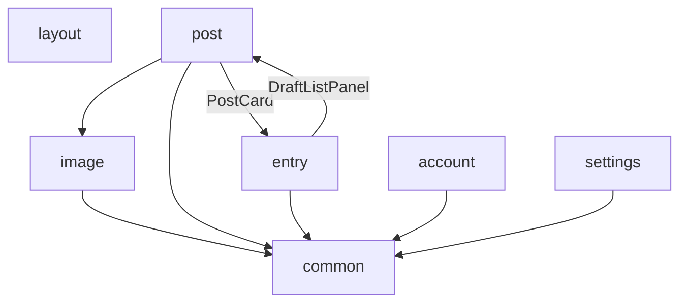

# components カテゴリ構成

`src/components/` は import 依存関係に基づき、以下7カテゴリへ分割している。各カテゴリの内部関係は `<category>/README.md` を参照。

- `common`: 特定機能に依存しない汎用UI部品(モーダル基盤・リスト表示・ページング・入力欄など)
- `image`: 画像選択・クロップ・リンクカード取得プレビュー・サムネイル表示と拡大表示まわりの部品
- `post`: Bluesky投稿(タイムライン・投稿フォーム・投稿カード)まわりの部品
- `entry`: skyshare entry(下書き・保存済みページ)の一覧・編集・削除まわりの部品
- `account`: アカウント切り替え・ログインまわりの部品
- `settings`: 設定一覧・設定ダイアログまわりの部品
- `layout`: サイドバー・フッターナビ・ページmetaなど、ページ全体のレイアウト部品

## カテゴリ間の依存関係

```mermaid
graph TD
  layout[layout]

  image --> common
  post --> common
  post --> image
  post -- PostCard --> entry
  entry -- DraftListPanel --> post
  entry --> common
  account --> common
  settings --> common
```

- `post` と `entry` は相互参照している(`PostCard` が `EntryDeleteConfirmDialog` を、`DraftListPanel` が `SelfLabelsSelect` の定数を、`EntryDetailView` が `PostBody` をそれぞれ参照)。カテゴリ間循環にはなっているが、いずれもUIパーツの再利用であり実装上の問題はない。
- `layout` は他カテゴリに依存しない独立したカテゴリ。

## 文言の多言語対応

コンポーネントに日本語・英語の文言を直書きしない。文言は `src/lib/i18n/messages/` の辞書に定義し、React では `useT()`、`.astro` では `createTranslator(Astro.locals.locale)` で取得する。直書きは `tests/lib/i18n/noHardcodedText.test.ts` が検出する。手順の詳細は `DEVELOP.md` の「多言語対応（i18n）」を参照。
