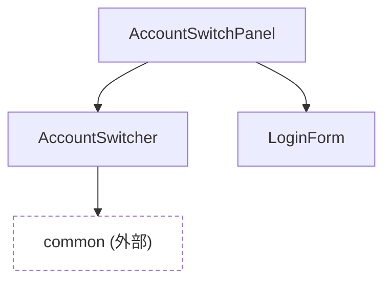

# account

アカウント切り替え・ログインまわりの部品。

```mermaid
graph TD
  AccountSwitchPanel --> AccountSwitcher
  AccountSwitchPanel --> LoginForm
  AccountSwitcher --> commonExt

  commonExt["common (外部)"]

  classDef external stroke-dasharray: 4 3,fill:transparent;
  class commonExt external;
```

外部カテゴリへの依存の内訳: `common`: AccountSwitcher(ComponentList)
