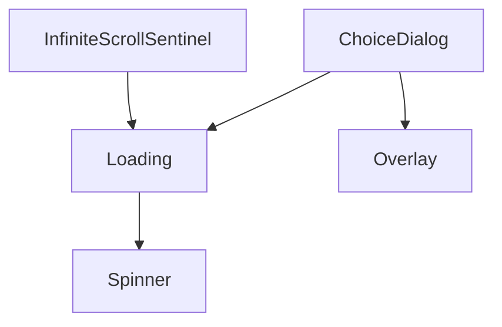

# common

特定の機能ドメインに依存しない汎用UI部品。モーダル基盤(`Overlay`/`ChoiceDialog`/`Loading`)、リスト表示・ページング(`ComponentList`/`NavigationBar`/`PageSizeSelect`/`PaginationModeSelect`/`InfiniteScrollSentinel`)、フローティング表示(`FloatingBox`)、入力系(`CountedTextInput`/`ToggleSwitch`/`LanguageSelect`)、汎用UI(`Collapsible`/`Spinner`/`InlineIcon`/`Avatar`)から成る。

上記4部品以外は他のcommon部品への依存を持たない独立した部品(単体で完結するため図には含めていない): `Avatar`・`Collapsible`・`ComponentList`・`CountedTextInput`・`FloatingBox`・`InlineIcon`・`LanguageSelect`・`NavigationBar`・`PageSizeSelect`・`PaginationModeSelect`・`ToggleSwitch`

- `FloatingBox` は`Overlay`と同じ`createPortal`技法で`document.body`直下へ描画するが、中身（`children`）を一切関知しない薄いプリミティブであり、`Overlay`への依存は持たない(z-indexの整合のみ`Overlay`が定義する`--overlay-z`変数をCSS上で参照する)。
- `PaginationModeSelect` は現在どこからも参照されていないデッドコード([../dead.md](../dead.md)参照)。
- `ComponentList`・`Overlay`・`Loading`・`ChoiceDialog`・`NavigationBar` は他カテゴリから最も多く参照される基盤部品。
