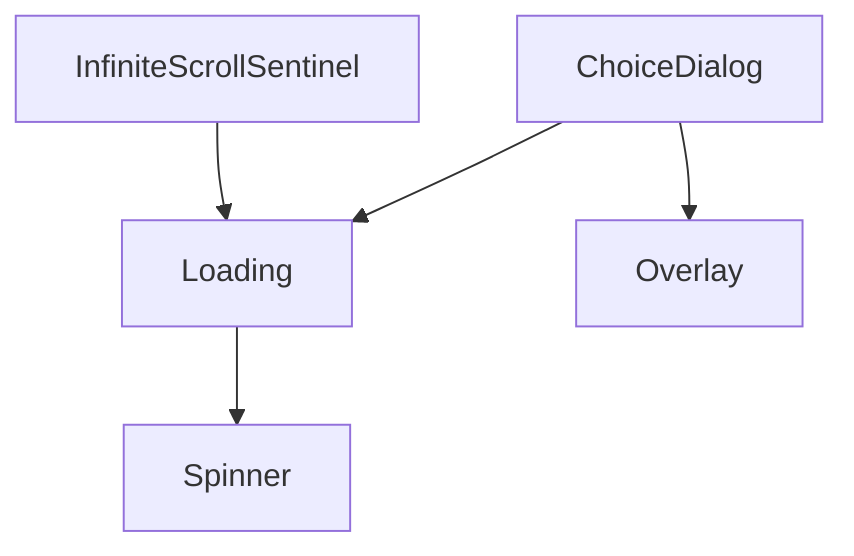

# common

特定の機能ドメインに依存しない汎用UI部品。モーダル基盤(`Overlay`/`ChoiceDialog`/`Loading`)、リスト表示・ページング(`ComponentList`/`NavigationBar`/`PageSizeSelect`/`PaginationModeSelect`/`InfiniteScrollSentinel`)、入力系(`CountedTextInput`/`ToggleSwitch`/`LanguageSelect`)、汎用UI(`Collapsible`/`Spinner`)から成る。

上記4部品以外は他のcommon部品への依存を持たない独立した部品(単体で完結するため図には含めていない): `Collapsible`・`ComponentList`・`CountedTextInput`・`LanguageSelect`・`NavigationBar`・`PageSizeSelect`・`PaginationModeSelect`・`ToggleSwitch`

- `PaginationModeSelect` は現在どこからも参照されていないデッドコード([../dead.md](../dead.md)参照)。
- `ComponentList`・`Overlay`・`Loading`・`ChoiceDialog`・`NavigationBar` は他カテゴリから最も多く参照される基盤部品。
