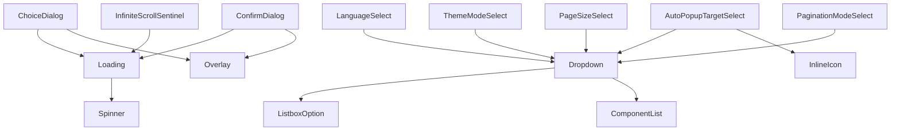

# common

特定の機能ドメインに依存しない汎用UI部品。モーダル基盤(`Overlay`/`ChoiceDialog`/`ConfirmDialog`/`Loading`)、リスト表示・ページング(`ComponentList`/`NavigationBar`/`PageSizeSelect`/`PaginationModeSelect`/`InfiniteScrollSentinel`)、フローティング表示(`FloatingBox`)、入力系(`CountedTextInput`/`ToggleSwitch`/`Dropdown`/`ListboxOption`/`LanguageSelect`/`ThemeModeSelect`/`AutoPopupTargetSelect`)、汎用UI(`Collapsible`/`Spinner`/`InlineIcon`/`Avatar`)から成る。

```mermaid
graph TD
  ChoiceDialog --> Loading
  ChoiceDialog --> Overlay
  ConfirmDialog --> Loading
  ConfirmDialog --> Overlay
  Loading --> Spinner
  InfiniteScrollSentinel --> Loading
  Dropdown --> ListboxOption
  Dropdown --> ComponentList
  LanguageSelect --> Dropdown
  ThemeModeSelect --> Dropdown
  AutoPopupTargetSelect --> Dropdown
  AutoPopupTargetSelect --> InlineIcon
  PageSizeSelect --> Dropdown
  PaginationModeSelect --> Dropdown
```

上記以外は他のcommon部品への依存を持たない独立した部品(単体で完結するため図には含めていない): `Avatar`・`Collapsible`・`ComponentList`・`CountedTextInput`・`FloatingBox`・`InlineIcon`・`ListboxOption`・`NavigationBar`・`ToggleSwitch`

- `ConfirmDialog`は`ChoiceDialog`が定義する`DialogButtonVariant`型・`variantClassName`（ボタン配色）をimportして再利用するが、UI構造・責務は独立している（`ChoiceDialog`はボタン列挙（任意で`description`の説明文を1つ表示可）のみ、`ConfirmDialog`はタイトル・本文メッセージ・確定/キャンセルボタンを持つ）。

- `FloatingBox` は`Overlay`と同じ`createPortal`技法で`document.body`直下へ描画するが、中身（`children`）を一切関知しない薄いプリミティブであり、`Overlay`への依存は持たない(z-indexの整合のみ`Overlay`が定義する`--overlay-z`変数をCSS上で参照する)。
- `Dropdown` はアプリ共通のプルダウン（`<select>`の代替）。パネルはトリガーと同じ外枠の中の`position:absolute`（ポータル・`FloatingBox`は使わず、スクロール・キーボードへの追従はブラウザ任せ。親の`overflow`は`ui.module.css`が`data-dropdown`を目印に解除する）、選択肢行は`ListboxOption`（`post/SuggestPopover`と共用）、反復描画は`ComponentList`に委譲する。パネル幅は全選択肢のうち最も広いものに合わせる。`searchable` ではトリガー自身が入力欄になり、1回目の操作で一覧モード、開いたまま再操作で検索モード（トリガーへ入力して絞り込む）。詳細は[specs/dropdown](../../../specs/dropdown)。
- `PaginationModeSelect` は現在どこからも参照されていないデッドコード([../dead.md](../dead.md)参照)。
- `ComponentList`・`Overlay`・`Loading`・`ChoiceDialog`・`NavigationBar` は他カテゴリから最も多く参照される基盤部品。
