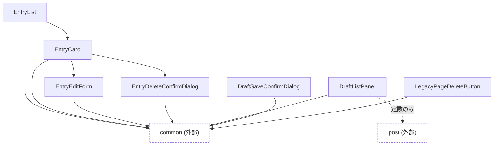

# entry

skyshare entry(下書き・保存済みページ)の一覧表示・編集・削除まわりの部品。

外部カテゴリへの依存の内訳:

- `common`: EntryList(ComponentList・InfiniteScrollSentinel・NavigationBar・PageSizeSelect)、EntryCard(ChoiceDialog・Loading)、EntryEditForm(Overlay・Loading・CountedTextInput)、EntryDeleteConfirmDialog(ChoiceDialog)、DraftListPanel(ComponentList・NavigationBar)、DraftSaveConfirmDialog(ChoiceDialog)、LegacyPageDeleteButton(Loading)
- `post`: DraftListPanel(SelfLabelsSelect のラベル表示用定数のみ)

- `DraftListPanel` が `post` カテゴリの `SelfLabelsSelect` からラベル表示用の定数のみを参照している([../README.md](../README.md)のカテゴリ間相互参照を参照)。
