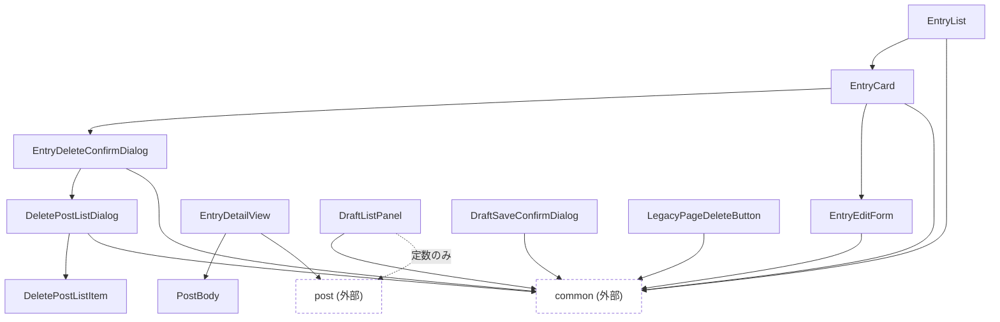

# entry

skyshare entry(下書き・保存済みページ)の一覧表示・編集・削除まわりの部品。

```mermaid
graph TD
  EntryList --> EntryCard
  EntryCard --> EntryDeleteConfirmDialog
  EntryDeleteConfirmDialog --> DeletePostListDialog
  DeletePostListDialog --> DeletePostListItem
  EntryCard --> EntryEditForm
  EntryDetailView --> PostBody

  EntryList --> commonExt
  EntryCard --> commonExt
  EntryEditForm --> commonExt
  EntryDeleteConfirmDialog --> commonExt
  DeletePostListDialog --> commonExt
  DraftListPanel --> commonExt
  DraftSaveConfirmDialog --> commonExt
  LegacyPageDeleteButton --> commonExt
  DraftListPanel -. 定数のみ .-> postExt
  EntryDetailView --> postExt

  commonExt["common (外部)"]
  postExt["post (外部)"]

  classDef external stroke-dasharray: 4 3,fill:transparent;
  class commonExt,postExt external;
```

外部カテゴリへの依存の内訳:

- `common`: EntryList(ComponentList・InfiniteScrollSentinel・NavigationBar・PageSizeSelect)、EntryCard(ChoiceDialog・Loading)、EntryEditForm(Overlay・Loading・CountedTextInput)、EntryDeleteConfirmDialog(ChoiceDialog)、DeletePostListDialog(Overlay・Loading・ComponentList・ChoiceDialogのボタン配色)、DraftListPanel(ComponentList・NavigationBar)、DraftSaveConfirmDialog(ChoiceDialog)、LegacyPageDeleteButton(Loading)
- `post`: DraftListPanel(SelfLabelsSelect のラベル表示用定数のみ)、EntryDetailView(PostBody)

- `DraftListPanel` が `post` カテゴリの `SelfLabelsSelect` からラベル表示用の定数のみを参照している([../README.md](../README.md)のカテゴリ間相互参照を参照)。
- `EntryDetailView` は Entry詳細ページ全体（ヘッダーカード・投稿カード配列・下部余白・エラーペイン）を描く Astro コンポーネントで、投稿カードの表示部に `post` カテゴリの `PostBody` を使う。
