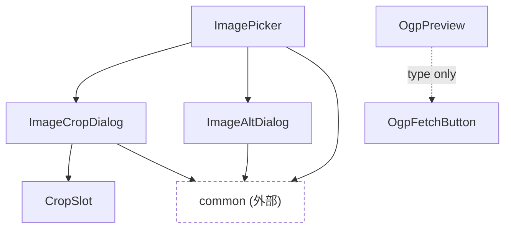

# image

画像添付・クロップ・リンクカードプレビューまわりの部品。`post`カテゴリ(`PostForm`)から利用される。

```mermaid
graph TD
  ImagePicker --> ImageCropDialog
  ImagePicker --> ImageAltDialog
  ImageCropDialog --> CropSlot
  OgpPreview -. type only .-> OgpFetchButton

  ImageCropDialog --> commonExt
  ImageAltDialog --> commonExt
  ImagePicker --> commonExt

  commonExt["common (外部)"]

  classDef external stroke-dasharray: 4 3,fill:transparent;
  class commonExt external;
```

外部カテゴリへの依存の内訳: `common`: ImageCropDialog(Overlay・Loading)、ImageAltDialog(Overlay)、ImagePicker(Loading)
