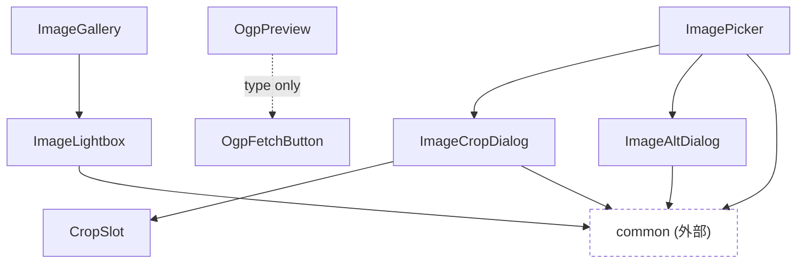

# image

画像添付・クロップ・リンクカードプレビュー・サムネイル表示/拡大表示まわりの部品。`post`・`entry`カテゴリから利用される。

外部カテゴリへの依存の内訳: `common`: ImageCropDialog(Overlay・Loading)、ImageAltDialog(Overlay)、ImagePicker(Loading)、ImageLightbox(Overlay)
