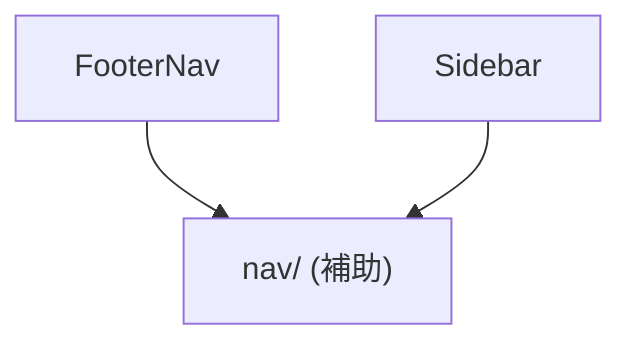

# layout

サイドバー・フッターナビ・ページmetaなど、ページ全体のレイアウトを構成する部品。他カテゴリへの依存はない。

- `nav/` は `FooterNav`・`Sidebar` 共通のナビゲーション項目定義(`navItems`)・アイコン(`NavIcon`)・アクティブ状態同期ロジック(`syncActiveState`・`syncAccountAvatar`)をまとめた補助ディレクトリ(単体のコンポーネントではない)。
- `Metadatas` は `FooterNav`・`Sidebar` のどちらにも依存関係を持たず、`src/layout/Baselayout.astro` から単独で利用される、`<head>` 用メタタグ出力コンポーネント(図には含めていない)。
