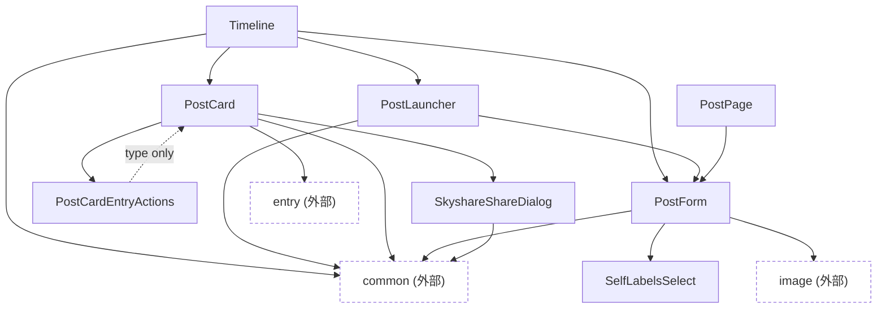

# post

Bluesky投稿(タイムライン表示・投稿フォーム・投稿カード・共有)まわりの部品。

外部カテゴリへの依存の内訳:

- `common`: Timeline(ComponentList・InfiniteScrollSentinel・NavigationBar・PageSizeSelect)、PostLauncher(Overlay)、PostCard(Loading)、PostForm(Collapsible・CountedTextInput・LanguageSelect・Loading・Overlay・ToggleSwitch)、SkyshareShareDialog(ChoiceDialog)
- `image`: PostForm(ImagePicker・ImagePreview・OgpFetchButton・OgpPreview)
- `entry`: PostCard(EntryDeleteConfirmDialog)

- `PostEngagementStats` は他コンポーネントへの依存を持たない単体の表示部品。
- `PostCard` が `entry` カテゴリの `EntryDeleteConfirmDialog` を参照している([../README.md](../README.md)のカテゴリ間相互参照を参照)。
