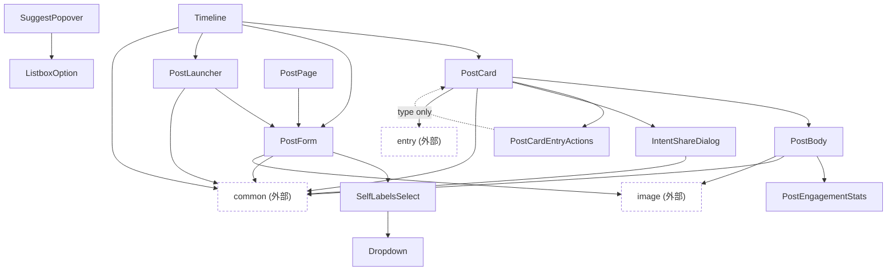

# post

Bluesky投稿(タイムライン表示・投稿フォーム・投稿カード・共有)まわりの部品。

```mermaid
graph TD
  Timeline --> PostCard
  Timeline --> PostForm
  Timeline --> PostLauncher
  PostLauncher --> PostForm
  PostCard --> PostBody
  PostBody --> PostEngagementStats
  PostCard --> PostCardEntryActions
  PostCard --> IntentShareDialog
  PostCardEntryActions -. type only .-> PostCard
  PostForm --> SelfLabelsSelect
  SelfLabelsSelect --> Dropdown
  SuggestPopover --> ListboxOption
  PostPage --> PostForm

  Timeline --> commonExt
  PostLauncher --> commonExt
  PostCard --> commonExt
  PostForm --> commonExt
  IntentShareDialog --> commonExt
  PostForm --> imageExt
  PostCard --> entryExt
  PostBody --> commonExt
  PostBody --> imageExt

  commonExt["common (外部)"]
  imageExt["image (外部)"]
  entryExt["entry (外部)"]

  classDef external stroke-dasharray: 4 3,fill:transparent;
  class commonExt,imageExt,entryExt external;
```

外部カテゴリへの依存の内訳:

- `common`: Timeline(ComponentList・InfiniteScrollSentinel・NavigationBar・PageSizeSelect)、PostLauncher(Overlay)、PostCard(Loading)、PostBody(Avatar)、PostForm(Collapsible・CountedTextInput・LanguageSelect・Loading・Overlay・ToggleSwitch)、IntentShareDialog(ChoiceDialog)
- `image`: PostForm(ImagePicker・ImageAltDialog・OgpFetchButton・OgpPreview)、PostBody(ImageGallery)
- `entry`: PostCard(EntryDeleteConfirmDialog)

- `PostEngagementStats` は他コンポーネントへの依存を持たない単体の表示部品。
- `PostCard` が `entry` カテゴリの `EntryDeleteConfirmDialog` を参照している([../README.md](../README.md)のカテゴリ間相互参照を参照)。
- `PostBody` は作者・日時・本文・画像・リアクション数を描く表示専用部品で、Timeline(`PostCard`)と Entry詳細ページ(`entry`カテゴリの `EntryDetailView`)から共通利用される。
