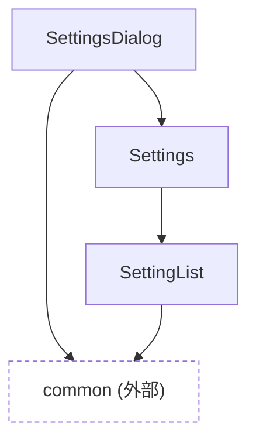

# settings

設定項目一覧・設定ダイアログまわりの部品。`src/pages/settings.astro` から `Settings` が直接使われるほか、`SettingsDialog` としてどの画面からも開閉できる。

外部カテゴリへの依存の内訳: `common`: SettingsDialog(Overlay)、SettingList(ComponentList・ToggleSwitch)
